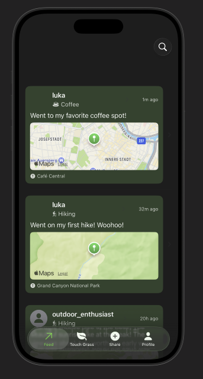
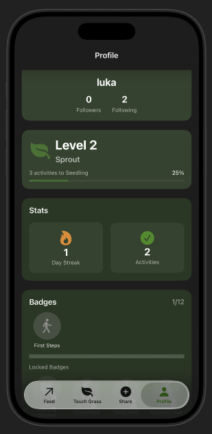

# Go Touch Grass




A new iOS social media and personal tracking app for all activities done outside.

Limited to *one* activity post per day to prevent spam, and encourage getting off the app and actually doing some activities (this also helps rate limit users and with pricing). Users on an eventual 'Pro' tier can post unlimited 'Touch Grass' activities per day.

Follow your friends to see what they are up to outside, and track your own activities. Earn badges for each new type of activity you do, and earn levels in each type that you're persistent in.

## Setup Instructions

### Prerequisites
- Xcode (latest version)
- A Supabase account and project

### Supabase Configuration
1. Create a Supabase project at [https://supabase.com](https://supabase.com)
2. Navigate to your project settings: `Settings > API`
3. Copy your **Project URL** and **anon/public key**
4. In the project directory, navigate to `Go Touch Grass/Go Touch Grass/Config/`
5. Copy `SupabaseConfig.swift.template` to `SupabaseConfig.swift`
6. Open `SupabaseConfig.swift` and replace the placeholder values:
   ```swift
   enum SupabaseConfig {
       static let url = "https://your-project-id.supabase.co"  // Your Project URL
       static let anonKey = "your-anon-key-here"               // Your anon/public key
   }
   ```
7. **IMPORTANT**: Never commit `SupabaseConfig.swift` to version control (it's already gitignored)

### Email Auth in Supabase

1. Go to your [Supabase Dashboard](https://supabase.com/dashboard)
2. Select your project
3. Navigate to **Authentication** → **Providers** in the left sidebar
4. Find **Email** in the providers list
5. Make sure **Enable Email provider** is toggled ON
6. Configure the following settings:
   - **Confirm email:** Toggle OFF for development (toggle ON for production)
   - **Secure email change:** Toggle ON (recommended)
   - **Secure password change:** Toggle ON (recommended)
7. Click **Save**

## Tech Stack
| Layer         | Choice                              |
| ------------- | ----------------------------------- |
| Frontend      | SwiftUI                             |
| State         | MVVM                                |
| Auth          | Supabase Auth                       |
| DB            | PostgreSQL                          |
| Realtime      | Supabase Realtime (limited)         |
| Media         | Supabase Storage                    |
| Backend Logic | Supabase Edge Functions             |
| Maps          | MapKit                              |
| Analytics     | PostHog (self-host later if needed) |


## Development Checklist

### Phase 0 — Project Setup
- [x] Install latest Xcode
- [x] Create new iOS App project
  - [x] Interface: SwiftUI
  - [x] Language: Swift
  - [x] Minimum iOS version: current – 1
- [x] Run app successfully on simulator
- [x] Set up Git repository
- [x] Add basic README

### Phase 1 — SwiftUI Foundations (No Backend)
Goal: App is fully navigable with fake data

#### App Structure
- [x] Set up TabView
  - [x] Feed tab
  - [x] Log Activity tab
  - [x] Profile tab
- [x] Create NavigationStack per tab

#### Data Models
- [x] Create Activity model
- [x] Create User model (minimal)

#### Feed Screen
- [x] Display list of activities
- [x] Activity row shows:
  - [x] Username
  - [x] Activity type
  - [x] Timestamp
- [x] Tap activity → Activity Detail screen

#### Activity Detail Screen
- [x] Notes / description
- [x] Map placeholder
- [x] “Nice” button (no functionality yet)

#### Share Activity Screen
- [x] Activity type picker
- [x] Notes text field
- [x] Location picker
- [x] Save button adds activity to in-memory list

#### Profile Screen
- [x] Username display
- [x] Activity streak placeholder
- [x] List of recent activities

#### Search and follow friends
- [x] Make profiles clickable in the feed and detail view
- [x] Provide a search by username
- [x] 'Follow' button

### Enhanced Profiles
- [x] Badges
- [x] Badge levels
- [x] Dark mode
- [ ] Settings page (change username, upload/change PFP, delete account, export activities)
- [ ] Public/private access
- [ ] Require 'Friendship' requests to follow

#### Touch Grass Screen
- [x] Local activities in a user's area (static data for now)

### Phase 2 — Architecture Cleanup (Still No Backend)
Goal: Introduce MVVM without overengineering

- [x] Create FeedViewModel
- [x] Create ShareViewModel
- [x] Create EventViewModel
- [x] Create ProfileViewModel
- [x] Move activity logic out of views
- [x] Use Observable / ObservableObject
- [x] Inject view models via StateObject
- [x] Remove logic from SwiftUI views where possible

### Phase 3 — Backend (Minimal + Cost-Safe)
Goal: Replace fake data with real persistence

#### Supabase Setup
- [x] Create Supabase project
- [x] Choose free tier to start
- [ ] Set hard spending limit
- [x] Add Supabase Swift SDK
- [x] Connect views/models to supabase via PostgREST

#### Auth
- [x] Sign up/sign in
- [x] Store user session
- [x] Handle log out

#### Database Architecture
- [x] User database objects
- [x] Activity database objects
- [x] Activity types table
- [x] Activity subtypes
- [x] Activity likes
- [x] User badges and levels

#### More Database Activity Types
- [ ] Gym with subtypes (Push, Pull, Leg, Cardio)
- [ ] Cooking Class
- [ ] Dinner
- [ ] Movie
- [ ] Bar
- [ ] Basketball
- [ ] Football
- [ ] Soccer
- [ ] Groceries
- [ ] Cleaning
- [ ] Coffee (possible subtypes)

#### Touch Grass Connects to API
- [ ] Find public APIs/databases (ideally free or low-cost) to connect to for local outdoor events
- [ ] Setup service for connection and retrieval of events based on location input

### Phase 5 - App Rollout

### Free and Pro-Tiers
- [ ] Pro-tier pricing and ecommerce logic
- [ ] Support unlimited activity posts per day based on a user's tier
- [ ] Event recommendations based on a user's preferred/most common activities

### iOS publication
- [ ] Terms of Service, privacy policy, risk warnings
- [ ] iOS page
- [ ] App logo