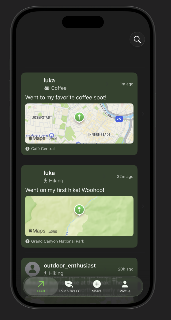
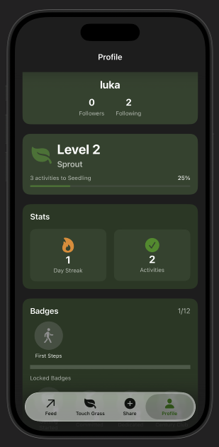

# Go Touch Grass




A new iOS social media and personal tracking app for all activities done outside.

Limited to *one* activity post per day to prevent spam, and encourage getting off the app and actually doing some activities (this also helps rate limit users and with pricing). Users on an eventual 'Pro' tier can post unlimited 'Touch Grass' activities per day.

Follow your friends to see what they are up to outside, and track your own activities. Earn badges for each new type of activity you do, and earn levels in each type that you're persistent in.

## Key Features

- **Daily Activity Recommendations**: Get 5 personalized outdoor activity suggestions every day in the Touch Grass tab
- **Activity Tracking**: Log your outdoor activities with location, photos, and notes
- **Social Feed**: Follow friends and see their outdoor adventures
- **Badges & Levels**: Earn achievements and level up based on your activity history
- **Private Accounts**: Control who can see your activities with privacy settings

## Setup Instructions

### Prerequisites
- Xcode (latest version)
- A Supabase account and project

### Supabase Configuration
1. Create a Supabase project at [https://supabase.com](https://supabase.com)
2. Navigate to your project settings: `Settings > API`
3. Copy your **Project URL** and **anon/public key**
4. In the project directory, navigate to `Go Touch Grass/Go Touch Grass/Config/`
5. Copy `SupabaseConfig.swift.template` to `SupabaseConfig.swift`
6. Open `SupabaseConfig.swift` and replace the placeholder values:
   ```swift
   enum SupabaseConfig {
       static let url = "https://your-project-id.supabase.co"  // Your Project URL
       static let anonKey = "your-anon-key-here"               // Your anon/public key
   }
   ```
7. **IMPORTANT**: Never commit `SupabaseConfig.swift` to version control (it's already gitignored)

### Email Auth in Supabase

1. Go to your [Supabase Dashboard](https://supabase.com/dashboard)
2. Select your project
3. Navigate to **Authentication** → **Providers** in the left sidebar
4. Find **Email** in the providers list
5. Make sure **Enable Email provider** is toggled ON
6. Configure the following settings:
   - **Confirm email:** Toggle OFF for development (toggle ON for production)
   - **Secure email change:** Toggle ON (recommended)
   - **Secure password change:** Toggle ON (recommended)
7. Click **Save**

## Tech Stack
| Layer         | Choice                              |
| ------------- | ----------------------------------- |
| Frontend      | SwiftUI                             |
| State         | MVVM                                |
| Auth          | Supabase Auth                       |
| DB            | PostgreSQL                          |
| Realtime      | Supabase Realtime (limited)         |
| Media         | Supabase Storage                    |
| Backend Logic | Supabase Edge Functions             |
| Maps          | MapKit                              |
| Analytics     | PostHog (self-host later if needed) |


## Recent Updates

### Touch Grass Tab Overhaul (May 2026)
The Touch Grass tab has been completely redesigned to focus on daily activity recommendations instead of event discovery:

- **NEW**: Daily personalized activity recommendations (5 cards per day)
- **NEW**: Smart recommendation algorithm based on user preferences and history
- **NEW**: 50+ activity templates across 8 categories (Running, Walking, Hiking, Cycling, Climbing, Swimming, Kayaking, Other)
- **NEW**: Pull-to-refresh and manual refresh (rate-limited to 3x/day)
- **NEW**: Progress tracking with visual indicators
- **REMOVED**: Event discovery and RSVP system (user-generated events, Ticketmaster API integration)

See [PRD: Touch Grass Tab Overhaul](prds/touch-grass-tab-overhaul.md) for full details.

## TODO

- [ ] More Database Activity Types (Gym w/ subtypes, Cleaning, Dinner, Movie, Park)
- [ ] V2 Recommendation Features:
  - [ ] Weather-aware recommendations
  - [ ] Social layer ("3 friends did this activity")
  - [ ] Activity history view
  - [ ] "Not interested" feedback button
  - [ ] Template personalization with user-specific variables
- [ ] Pro-tier: Pricing, enhanced recommendations, unlimited activities per day
- [ ] Terms of Service, privacy policy, risk warnings
- [ ] Deploy and publish
